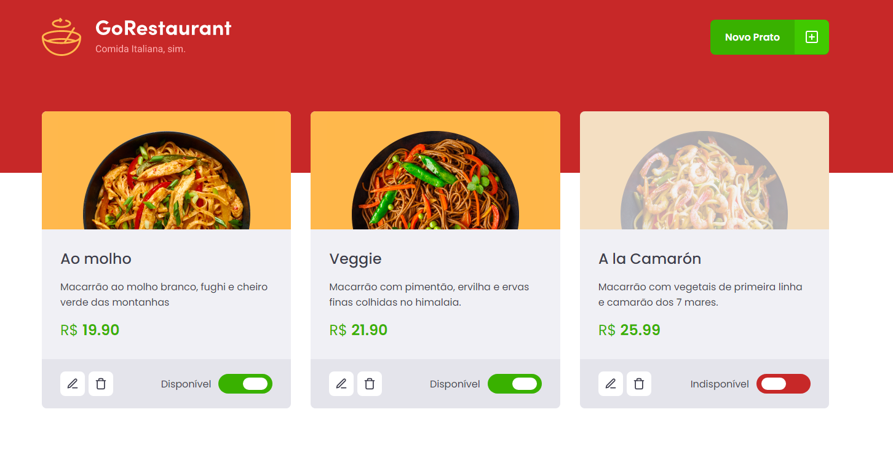
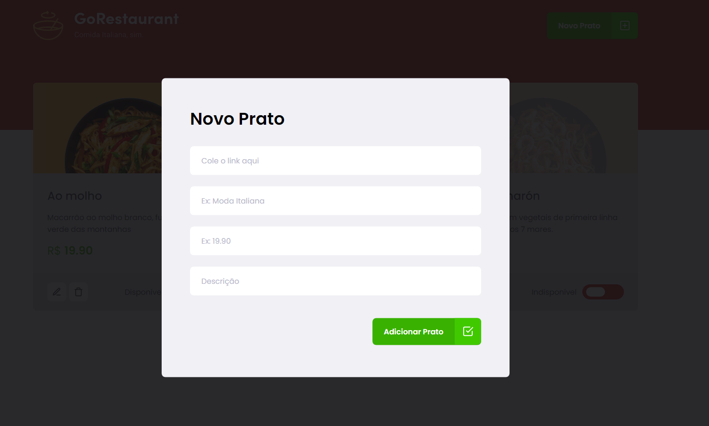

<h1 align="center">
    GoRestaurant
</h1>

<h4 align="center">
  🚀 GoRestaurant is a challenge developed during Rocketseat Ignite training
</h4>

## 💻 Projeto

GoRestaurant is a challenge developed during Rocketseat's Ignite training. The challenge is to migrate the components of the JavaScript application to Typescript and from Class Components to Function.

## 🛠 Technologies used

This project was developed with the following technologies:

- [React](https://reactjs.org)
- [TypeScript](https://www.typescriptlang.org/)
- [Styled Components](https://styled-components.com/)

### 🎲 Running application

```bash
# Clone this repository
$ git clone https://github.com/FilipeRK/Ignite-Challenge04-GoRestaurant.git

# Access the project folder in the / cmd terminal. Example:
$ cd Ignite-Challenge04-GoRestaurant

# Install the dependencies
$ yarn

# Run fakeAPI, which will run on the path: http://localhost:3333
$ yarn server

# Run the application, which will run on the path http://localhost:3000
$ yarn start
```

# Pictures of running application 
### Main screen



### Add new food



#

<br />
<p >Developed by <a href="https://github.com/FilipeRK">Filipe Kohls </a>
